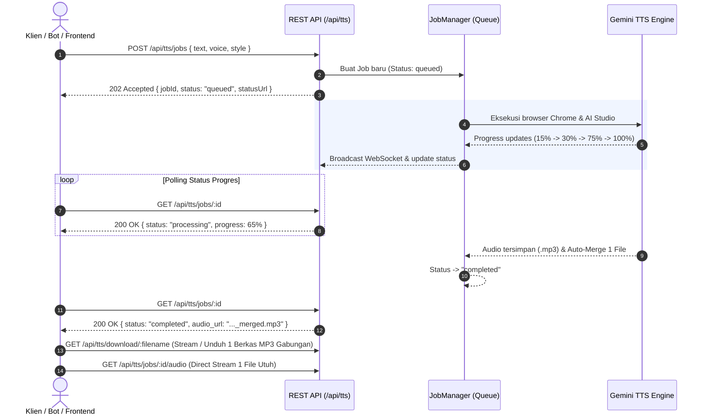

# 📖 Dokumentasi REST API - AuStudio Gemini TTS Service (Jobs Architecture)

Layanan REST API lokal berkinerja tinggi untuk menghasilkan suara sintetis (*Text-to-Speech*) menggunakan model **Google Gemini 2.5 Pro Preview TTS** melalui browser automation berfitur **Anti-Bot Evasion & Human Behavior Engine**.

Menggunakan arsitektur **Asynchronous Job Queue (Teknik Jobs)** sehingga aman dari HTTP timeout, naskah panjang terpotong, atau kendala jaringan pada render berdurasi lama.

---

## 🚀 Ringkasan & Base URL

* **Base URL**: `http://localhost:3000` (atau port lain sesuai port terbuka, misal `3001`)
* **Content-Type**: `application/json`
* **Format Audio Output**: `.mp3` (192 kbps, konversi otomatis via `ffmpeg-static`) & `.wav` (PCM kualitas studio)
* **Arsitektur Pemrosesan**: **Asynchronous Job Queue (Teknik Jobs)**
* **Dukungan Teks Panjang**: **Auto-Chunking & Auto-Merging** (naskah panjang diproses per bagian lalu otomatis digabungkan menjadi **1 berkas MP3 utuh**)

---

## ⚡ Mengapa Menggunakan Teknik Jobs?

Proses sintesis suara AI Studio memerlukan waktu antara 15 hingga 120 detik (bahkan lebih untuk naskah panjang multi-chunk). 

Dengan **Teknik Jobs**:
1. **Bebas HTTP Timeout**: Klien mengirim naskah dan langsung menerima `202 Accepted` bersama `jobId` dalam hitungan milidetik.
2. **Pelacakan Progres Real-time**: Klien dapat memantau persentase progres (`0%` hingga `100%`), tahapan proses (`initializing`, `configuring`, `rendering`, `downloading`), dan pesan status secara detail.
3. **Antrian Tertib**: Jika banyak permintaan datang bersamaan, peramban memproses tugas satu per satu secara tertib tanpa konflik sesi browser.
4. **Bisa Dibatalkan**: Tugas yang masih antre dapat dibatalkan sewaktu-waktu.
5. **Dukungan WebSocket**: Progres dapat dipantau via WebSocket real-time tanpa perlu polling.

### Diagram Alur Siklus Kerja Jobs:


---

## 🔐 Autentikasi API Key

Semua endpoint pembuatan suara dan manajemen job dilindungi dengan autentikasi API Key. Sertakan kunci melalui salah satu cara berikut:

1. **HTTP Header (Rekomendasi)**:
   ```http
   x-api-key: your-secret-api-key
   ```
2. **Authorization Bearer**:
   ```http
   Authorization: Bearer your-secret-api-key
   ```
3. **Query Parameter**:
   ```http
   ?api_key=your-secret-api-key
   ```

> [!TIP]
> Kunci API default dikonfigurasi di file [`.env`](file:///c:/Users/Jerry/Documents/CODING/austudio-playwright/.env):
> ```env
> AISTUDION_API_KEY=IkPzTzClQrVGj73OMWIm7TPkRTHnlj7M
> ```

---

## 📌 Daftar Endpoints

### 1. `POST /api/tts/jobs` (Buat Job TTS Baru - Rekomendasi Utama)
Mendaftarkan pekerjaan pembuatan audio TTS baru ke dalam antrian dan langsung mengembalikan respons `202 Accepted`.

#### Headers
```http
Content-Type: application/json
x-api-key: IkPzTzClQrVGj73OMWIm7TPkRTHnlj7M
```

#### Request Body Parameters
| Parameter | Tipe Data | Wajib? | Default | Keterangan |
| :--- | :--- | :--- | :--- | :--- |
| `text` | `string` | **Ya** | - | Naskah suara yang akan dibaca. |
| `voice` | `string` | Opsional | `"Zephyr"` | Nama karakter suara (pilihan: `Zephyr` [default], `Puck`, `Charon`, `Achird`, `Fenrir`, `Iapetus`, `Orus`, `Rasalgethi`, `Achernar`, dll.). |
| `style` | `string` | Opsional | `"Vocal Smile"` | Gaya bicara (`Vocal Smile`, `Newscaster`, `Whisper`, `Empathetic`, `Promo/Hype`, `Deadpan`). |
| `pace` | `string` | Opsional | `"Natural"` | Kecepatan (`Natural`, `Rapid Fire`, `The Drift`, `Staccato`). |
| `accent` | `string` | Opsional | `"Neutral"` | Aksen pembawaan (`Neutral`, `American (Gen)`, `American (Valley)`, `American (South)`, `British (RP)`, `British (Brixton)`, `Transatlantic`, `Australian`). |
| `autoChunk` | `boolean` | Opsional | `true` | Jika `true`, teks panjang (>300 kata) otomatis dipecah per bagian agar render tidak terpotong. |
| `maxWordsPerChunk` | `number` | Opsional | `300` | Batas jumlah kata per bagian pemotongan. |

> [!NOTE]
> Parameter **Scene**, **Sample Context**, dan **Voice Director / Persona** telah di-hardcode secara optimal di level server untuk menghasilkan intonasi storytelling yang alami dan engaging, sehingga klien **hanya perlu mengirim `text` dan `voice`** (opsional: `style`, `pace`, `accent`).
> Anda juga **TIDAK PERLU** mengetik `"Speaker 1 : "` di awal teks. Server otomatis menangani prefiks pembicara di antarmuka Google AI Studio.

#### Contoh Request:
```json
{
  "text": "Halo semuanya! Selamat datang di channel kita. Hari ini kita akan menjelajahi misteri terdalam samudera bumi.",
  "voice": "Zephyr",
  "style": "Vocal Smile",
  "pace": "Natural",
  "accent": "Neutral"
}
```

#### Contoh Response Sukses (`202 Accepted`):
```json
{
  "success": true,
  "message": "Pekerjaan TTS berhasil dibuat dan dimasukkan ke dalam antrian.",
  "jobId": "job_1788840812023_3fa32cbd",
  "status": "queued",
  "queuePosition": 1,
  "statusUrl": "http://localhost:3000/api/tts/jobs/job_1788840812023_3fa32cbd",
  "job": {
    "id": "job_1788840812023_3fa32cbd",
    "status": "queued",
    "progress": 0,
    "stage": "queued",
    "message": "Pekerjaan berhasil dibuat dan berada dalam antrian.",
    "queuePosition": 1,
    "createdAt": "2026-09-08T04:13:32.023Z",
    "params": {
      "textSnippet": "Halo semuanya! Selamat datang di channel kita...",
      "wordCount": 16,
      "voice": "Achernar",
      "style": "Vocal Smile"
    }
  }
}
```

---

### 2. `GET /api/tts/jobs/:id` (Cek Progres & Ambil Audio)
Mengecek status pengerjaan naskah berdasarkan ID pekerjaan. Saat berstatus `completed`, properti `result` berisi URL lengkap unduhan audio.

#### Path Parameter
* `:id` — ID pekerjaan yang diterima saat pembuatan (misal `job_1788840812023_3fa32cbd`).

#### Contoh Response Saat Masih Diproses (`status: "processing"`):
```json
{
  "success": true,
  "job": {
    "id": "job_1788840812023_3fa32cbd",
    "status": "processing",
    "progress": 65,
    "stage": "rendering",
    "message": "Gemini sedang merender suara bagian 1/1 (14s)...",
    "queuePosition": 0,
    "currentPart": 1,
    "totalParts": 1,
    "createdAt": "2026-09-08T04:13:32.023Z",
    "startedAt": "2026-09-08T04:13:33.100Z",
    "result": null
  }
}
```

#### Contoh Response Saat Selesai (`status: "completed"`):
> Jika naskah terdiri dari beberapa bagian (>300 kata), server otomatis menggabungkan seluruh bagian menjadi 1 berkas MP3 utuh (`mergedFile`). Nilai `audio_url`, `audioUrl`, dan `downloadUrl` langsung mengarah ke berkas gabungan tersebut.

```json
{
  "success": true,
  "job": {
    "id": "job_1790307783764_3fa32cbd",
    "status": "completed",
    "progress": 100,
    "stage": "completed",
    "message": "Semua 2 bagian audio berhasil dibuat dan digabungkan menjadi 1 file MP3 utuh.",
    "durationSeconds": 88,
    "createdAt": "2026-09-25T14:20:00.000Z",
    "startedAt": "2026-09-25T14:20:01.000Z",
    "completedAt": "2026-09-25T14:21:29.000Z",
    "audioUrl": "http://localhost:3000/api/tts/download/gemini_tts_1790307783764_merged.mp3",
    "audio_url": "http://localhost:3000/api/tts/download/gemini_tts_1790307783764_merged.mp3",
    "downloadUrl": "http://localhost:3000/api/tts/download/gemini_tts_1790307783764_merged.mp3",
    "mergedFile": {
      "filename": "gemini_tts_1790307783764_merged.mp3",
      "url": "http://localhost:3000/api/tts/download/gemini_tts_1790307783764_merged.mp3",
      "audio_url": "http://localhost:3000/api/tts/download/gemini_tts_1790307783764_merged.mp3",
      "sizeBytes": 3812249,
      "sizeKb": "3722.9",
      "isMerged": true,
      "totalParts": 2
    },
    "result": {
      "url": "http://localhost:3000/api/tts/download/gemini_tts_1790307783764_merged.mp3",
      "audio_url": "http://localhost:3000/api/tts/download/gemini_tts_1790307783764_merged.mp3",
      "audioUrl": "http://localhost:3000/api/tts/download/gemini_tts_1790307783764_merged.mp3",
      "audio_urls": [
        "http://localhost:3000/api/tts/download/gemini_tts_1790307783764_part1.mp3",
        "http://localhost:3000/api/tts/download/gemini_tts_1790307783764_part2.mp3"
      ],
      "totalChunks": 2,
      "voiceSettings": {
        "voice": "Zephyr",
        "style": "Vocal Smile",
        "pace": "Natural",
        "accent": "Neutral"
      },
      "mergedFile": {
        "filename": "gemini_tts_1790307783764_merged.mp3",
        "url": "http://localhost:3000/api/tts/download/gemini_tts_1790307783764_merged.mp3",
        "sizeBytes": 3812249,
        "sizeKb": "3722.9",
        "isMerged": true,
        "totalParts": 2
      },
      "files": [
        {
          "partIndex": 1,
          "totalParts": 2,
          "filename": "gemini_tts_1790307783764_part1.mp3",
          "url": "http://localhost:3000/api/tts/download/gemini_tts_1790307783764_part1.mp3",
          "sizeBytes": 2439372,
          "sizeKb": "2382.2",
          "wordCount": 299
        },
        {
          "partIndex": 2,
          "totalParts": 2,
          "filename": "gemini_tts_1790307783764_part2.mp3",
          "url": "http://localhost:3000/api/tts/download/gemini_tts_1790307783764_part2.mp3",
          "sizeBytes": 1373280,
          "sizeKb": "1341.1",
          "wordCount": 150
        }
      ]
    }
  }
}
```

---

### 3. `GET /api/tts/jobs` (Daftar Riwayat Semua Jobs)
Melihat daftar seluruh pekerjaan, status antrian, dan ringkasan statistik.

#### Query Parameters
* `status` (opsional): Filter status (`queued`, `processing`, `completed`, `failed`, `cancelled`).
* `limit` (opsional): Jumlah data yang diambil (default `50`).
* `offset` (opsional): Offset paginasi (default `0`).

#### Contoh Request:
```http
GET /api/tts/jobs?status=completed&limit=10
x-api-key: IkPzTzClQrVGj73OMWIm7TPkRTHnlj7M
```

#### Contoh Response:
```json
{
  "success": true,
  "total": 15,
  "limit": 10,
  "offset": 0,
  "stats": {
    "total": 15,
    "queued": 0,
    "processing": 1,
    "completed": 13,
    "failed": 1,
    "cancelled": 0,
    "isBusy": true,
    "currentJobId": "job_1788840812023_3fa32cbd"
  },
  "jobs": [ ... ]
}
```

---

### 4. `DELETE /api/tts/jobs/:id` (Batalkan Job Antrian)
Membatalkan pekerjaan yang statusnya masih `queued` di antrian.

* **Metode**: `DELETE /api/tts/jobs/:id` atau `POST /api/tts/jobs/:id/cancel`
* **Response Sukses (`200 OK`)**:
```json
{
  "success": true,
  "message": "Pekerjaan job_1788840812023_3fa32cbd berhasil dibatalkan.",
  "job": {
    "id": "job_1788840812023_3fa32cbd",
    "status": "cancelled",
    "message": "Pekerjaan dibatalkan oleh pengguna sebelum dieksekusi."
  }
}
```

---

### 5. `POST /api/tts/generate` (Fleksibel: Async Job atau Sinkron Langsung)
Endpoint multifungsi yang kompatibel dengan script lama:
* **Mode Standar (Asynchronous Job)**: Mengembalikan job segera (`202 Accepted`).
* **Mode Sinkron (`?sync=true` atau `{"sync": true}`)**: Menunggu seluruh proses pembuatan suara selesai sebelum mengembalikan berkas audio (cocok untuk skrip baris perintah singkat).

#### Contoh Pemanggilan Sinkron:
```bash
curl -X POST "http://localhost:3000/api/tts/generate?sync=true" \
  -H "Content-Type: application/json" \
  -H "x-api-key: IkPzTzClQrVGj73OMWIm7TPkRTHnlj7M" \
  -d '{"text": "Halo dunia!", "voice": "Achernar"}'
```

---

### 6. `GET /api/tts/jobs/:id/audio` (Ambil / Stream 1 Berkas Audio Utuh Berdasarkan Job ID)
Endpoint terpadu untuk mengambil atau memutar langsung file audio hasil pekerjaan TTS (kompatibel dengan standar API seperti ElevenLabs).
* Jika naskah dipotong menjadi banyak bagian (multi-chunk), endpoint ini **otomatis menyajikan 1 berkas MP3 hasil penggabungan utuh**.
* **Direct Stream**: `GET /api/tts/jobs/:id/audio`
* **Download Attachment**: `GET /api/tts/jobs/:id/audio?download=1`

---

### 7. `GET /api/tts/download/:filename`
Memutar (*stream*) atau mengunduh berkas audio `.mp3` atau `.wav` langsung via URL nama file atau ID pekerjaan.

* **URL Contoh**: `http://localhost:3000/api/tts/download/gemini_tts_1790307783764_merged.mp3`
* **Direct Audio Stream**: Mendukung HTTP Range (`Accept-Ranges: bytes`) untuk pemutar HTML5 audio (`<audio src="...">`), streaming player, dan scrubbing.
* **Download Attachment**: Berikan query `?download=1` untuk memaksa unduh sebagai file attachment.

---

### 8. `GET /api/health` & `GET /api/tts/status`
Mengecek kondisi server, status mesin TTS, dan statistik antrian.

#### Contoh Response `GET /api/health`:
```json
{
  "status": "healthy",
  "service": "AuStudio Gemini TTS API",
  "uptimeSeconds": 240,
  "timestamp": "2026-09-08T04:15:00.000Z",
  "jobs": {
    "total": 12,
    "queued": 0,
    "processing": 0,
    "completed": 12,
    "failed": 0,
    "isBusy": false
  },
  "ttsEngine": {
    "isBusy": false,
    "queueLength": 0
  }
}
```

---

## 💻 Contoh Integrasi Pola Jobs (Submit & Poll)

Berikut panduan implementasi pola Jobs (Kirim Tugas ➔ Tunggu Selesai ➔ Ambil Audio) di berbagai bahasa pemrograman.

### 1. Node.js (JavaScript / Fetch)
```javascript
const API_KEY = 'IkPzTzClQrVGj73OMWIm7TPkRTHnlj7M';
const BASE_URL = 'http://localhost:3000';

async function generateWithJobs(text, voice = 'Achernar') {
  console.log('1. Mengirim pekerjaan TTS baru...');
  
  // 1. Submit Job
  const createRes = await fetch(`${BASE_URL}/api/tts/jobs`, {
    method: 'POST',
    headers: {
      'Content-Type': 'application/json',
      'x-api-key': API_KEY
    },
    body: JSON.stringify({
      text,
      voice,
      style: 'Vocal Smile',
      autoChunk: true
    })
  });

  const jobInfo = await createRes.json();
  if (!jobInfo.success) {
    throw new Error(`Gagal membuat job: ${jobInfo.error}`);
  }

  const jobId = jobInfo.jobId;
  console.log(`✓ Job dibuat: ${jobId} (Antrian #${jobInfo.queuePosition})`);

  // 2. Poll Status berkala
  while (true) {
    await new Promise(r => setTimeout(r, 2500)); // Polling tiap 2.5 detik

    const statusRes = await fetch(`${BASE_URL}/api/tts/jobs/${jobId}`, {
      headers: { 'x-api-key': API_KEY }
    });
    const statusData = await statusRes.json();
    const job = statusData.job;

    console.log(`[${job.status.toUpperCase()}] ${job.progress}% - ${job.message}`);

    if (job.status === 'completed') {
      console.log('\n🎉 Audio Selesai!');
      console.log('🎧 URL Audio:', job.result.audio_url);
      return job.result;
    }

    if (job.status === 'failed') {
      throw new Error(`Pekerjaan gagal: ${job.error}`);
    }

    if (job.status === 'cancelled') {
      throw new Error('Pekerjaan dibatalkan.');
    }
  }
}

// Jalankan
generateWithJobs('Halo semuanya! Ini adalah uji coba teknik jobs yang sangat stabil.');
```

---

### 2. Python (`requests`)
```python
import time
import requests

API_KEY = "IkPzTzClQrVGj73OMWIm7TPkRTHnlj7M"
BASE_URL = "http://localhost:3000"
HEADERS = {
    "Content-Type": "application/json",
    "x-api-key": API_KEY
}

def generate_tts(text, voice="Achernar"):
    print("1. Mengirim naskah ke antrian jobs...")
    payload = {
        "text": text,
        "voice": voice,
        "style": "Vocal Smile",
        "autoChunk": True
    }
    
    # 1. Submit Job
    res = requests.post(f"{BASE_URL}/api/tts/jobs", json=payload, headers=HEADERS)
    res_data = res.json()
    
    if not res_data.get("success"):
        raise Exception(f"Gagal submit job: {res_data.get('error')}")
        
    job_id = res_data["jobId"]
    print(f"✓ Job berhasil dibuat: {job_id}")

    # 2. Polling loop
    while True:
        time.sleep(2.5)
        status_res = requests.get(f"{BASE_URL}/api/tts/jobs/{job_id}", headers=HEADERS)
        job = status_res.json().get("job", {})
        
        status = job.get("status")
        progress = job.get("progress", 0)
        message = job.get("message", "")
        
        print(f"[{status.upper()}] {progress}% - {message}")
        
        if status == "completed":
            audio_url = job["result"]["audio_url"]
            print(f"\n🎉 Audio Siap: {audio_url}")
            
            # Unduh berkas audio WAV
            audio_data = requests.get(audio_url).content
            with open("hasil_tts.wav", "wb") as f:
                f.write(audio_data)
            print("File disimpan sebagai 'hasil_tts.wav'")
            return audio_url
            
        elif status == "failed":
            raise Exception(f"Job gagal: {job.get('error')}")
        elif status == "cancelled":
            raise Exception("Job dibatalkan.")

if __name__ == "__main__":
    generate_tts("Halo dari Python! Teknik jobs ini membuat koneksi anti-timeout.")
```

---

### 3. Windows PowerShell (`Invoke-RestMethod`)
```powershell
$apiKey = "IkPzTzClQrVGj73OMWIm7TPkRTHnlj7M"
$baseUrl = "http://localhost:3000"
$headers = @{
    "Content-Type" = "application/json"
    "x-api-key" = $apiKey
}

# 1. Submit Job
$body = @{
    text = "Halo kawan-kawan! Selamat datang di tutorial PowerShell otomatisasi suara."
    voice = "Achernar"
    style = "Vocal Smile"
} | ConvertTo-Json

Write-Host "1. Mendaftarkan TTS Job baru..."
$createRes = Invoke-RestMethod -Uri "$baseUrl/api/tts/jobs" -Method Post -Headers $headers -Body $body
$jobId = $createRes.jobId
Write-Host "✓ Job dibuat: $jobId"

# 2. Polling loop
do {
    Start-Sleep -Seconds 3
    $statusRes = Invoke-RestMethod -Uri "$baseUrl/api/tts/jobs/$jobId" -Method Get -Headers $headers
    $job = $statusRes.job
    Write-Host "[$($job.status.ToUpper())] $($job.progress)% - $($job.message)"
} while ($job.status -eq "queued" -or $job.status -eq "processing")

if ($job.status -eq "completed") {
    Write-Host "`n🎉 Berhasil! Audio URL: $($job.result.audio_url)"
    Invoke-WebRequest -Uri $job.result.audio_url -OutFile "hasil_suara.wav"
    Write-Host "Audio tersimpan di 'hasil_suara.wav'!"
} else {
    Write-Host "Gagal: $($job.error)"
}
```

---

### 4. cURL (Terminal / Command Prompt)

#### A. Kirim Naskah (Submit Job):
```bash
curl -X POST http://localhost:3000/api/tts/jobs \
  -H "Content-Type: application/json" \
  -H "x-api-key: IkPzTzClQrVGj73OMWIm7TPkRTHnlj7M" \
  -d '{
    "text": "Halo! Ini adalah pengujian naskah via cURL.",
    "voice": "Achernar",
    "style": "Vocal Smile"
  }'
```

#### B. Cek Status Pekerjaan:
```bash
curl -X GET http://localhost:3000/api/tts/jobs/job_1788840812023_3fa32cbd \
  -H "x-api-key: IkPzTzClQrVGj73OMWIm7TPkRTHnlj7M"
```

#### C. Unduh Berkas Audio Hasil:
```bash
curl -o hasil.wav http://localhost:3000/api/tts/download/gemini_tts_1788840850123_part1.wav
```

---

## 📡 Live Real-Time Updates via WebSocket

Untuk antarmuka pengguna grafis (Web Dashboard) atau aplikasi yang ingin menampilkan *progress bar* tanpa teknik polling berkala, server menyediakan siaran WebSocket langsung di `ws://localhost:3000`:

```javascript
const ws = new WebSocket('ws://localhost:3000');

ws.onmessage = (event) => {
  const { type, data } = JSON.parse(event.data);
  
  switch (type) {
    case 'job_created':
      console.log('Job masuk antrian:', data.id);
      break;
    case 'job_started':
      console.log('Job mulai diproses:', data.id);
      break;
    case 'job_progress':
      console.log(`Progres [${data.id}]: ${data.progress}% - ${data.message}`);
      // Update UI Progress Bar:
      // progressBar.style.width = data.progress + '%';
      break;
    case 'job_completed':
      console.log('Job sukses! Audio URL:', data.result.audio_url);
      break;
    case 'job_failed':
      console.error('Job gagal:', data.error);
      break;
    case 'job_cancelled':
      console.log('Job dibatalkan:', data.id);
      break;
  }
};
```

---

## 🚨 Kode Status HTTP & Panduan Troubleshooting

| Status Code | Makna | Penjelasan |
| :--- | :--- | :--- |
| `202 Accepted` | Job Diterima | Pekerjaan berhasil dimasukkan ke antrian `JobManager`. Simpan `jobId` untuk polling. |
| `200 OK` | Sukses | Permintaan berhasil diproses (misal data status job, daftar jobs, atau mode sync). |
| `400 Bad Request` | Input Salah | Parameter `text` kosong atau bukan string valid. |
| `401 Unauthorized` | Kunci Hilang | Header `x-api-key` belum disertakan dalam request. |
| `403 Forbidden` | Kunci Salah | Nilai `x-api-key` tidak cocok dengan server `.env`. |
| `404 Not Found` | Tidak Ditemukan | `jobId` atau file audio tidak ditemukan di server. |
| `500 Internal Error` | Kendala Mesin | Terjadi error pada peramban Chrome Playwright atau sesi Google AI Studio. Jalankan `LOGIN.bat` untuk memperbarui sesi Google Anda. |
